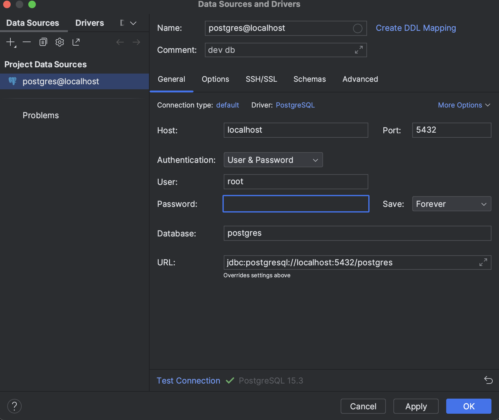
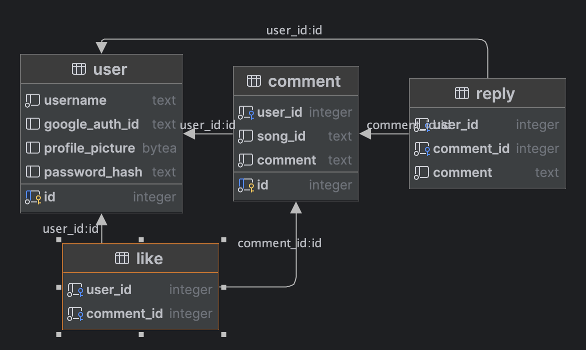

# Songscope development database instructions

We will use local database for development because it is easier to work with when it is running locally on your
computer. When we go into prod later, we will use CockroachDB to online host the production database.

Note: Run all commands from the db folder, and these need to be run any time changes are made to the SQL files. Or, you
can connect to the running Docker container and run the commands from there.

To build the image for the Docker container from the Dockerfile in this folder:

```docker build -t "songscope-db-image" .```

To create and run a container from the image and expose it on the computer's port (using 5432 as it is postgres'
default
port):

```docker run --name songscope-db -d -p 5432:5432 songscope-db-image```

To populate the new empty database with the data schema given:

```docker exec songscope-db "psql -d postgres -f /scripts/init_db.sql -f /scripts/sample_dev_data.sql;"```

The username and password for this development database is username: root and password: root. I used the following config for Jetbrains Datagrip but connection should be established on anything as long as the container is running.


The current schema layout for this database is attached below. It may be updated in the future.

